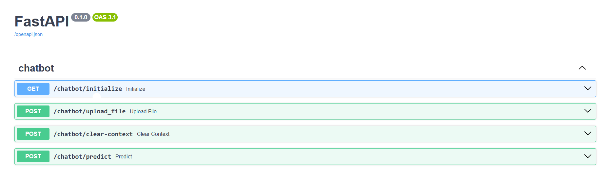

# ProntonGPT - Chatbot Application
### Live App - http://tringle.zapto.org:52003/

* ProtonGPT is capable of understanding & learning from `more than 1 files` at a time and solve users queries.
* Can accept files in different formats -  `.txt`, `.csv`, `.pdf`, `.docx`

* User has the option to `Wipe the memory of the chatbot` to clear the context & start refresh.

## Tech Stack used 

* The chatbot Application is built using `Llama 2` large language model -
`llama-2-7b-chat.ggmlv3.q8_0.bin`

* `Langchain` has been used to create `vectorDB` & documents (transformed input file to store & search information for the LLM).

* `HuggingFaceEmbeddings` to capture the semantic meanning of the input file's content.

* `Facebook AI Similarity Search (Faiss)` for efficient searching of `vectorDB` created using `Langchain`.

* `PostgreSQL` - To store all user uploaded files in an optimzied way.

* `AWS & Nginx`  -To host the chatbot publicly.

* `React & Antdesign` - To make the UI.


## Features 

### Backend

#### 1. Swagger API 

   


* `/chatbot/initialize` - To initialze the ProtonGPT chatbot. 

* `/chatbot/upload_file` - To upload multiple files simultaneously (`.txt`, `.csv`, `.pdf`, `.docx`) and lesser than **10mb** size.

* `/chatbot/clear-context` -  Clear the context of the chatbot to give it a fesh start.

* `/chatbot/predict` - To answer the question put in by the user.

#### 2. PostgreSQL

To store all user uploaded files in an optimzied way.

#### 3. ASW & Nginx
To host the chatbot publicly.

### Frontend

1. Made the UI using `React & AntDesign Components`.

2. Added features on the UI like - 
   - `Chatbox` to interact with ProtonGPT.
   - `Prompts` like `Chatbot activated`, `File uploaded`, `File size exceeded 10 mb`, `File extension not supported`.
   - Selecting multiple files in 1 go.
   - Deleting Files
   - Activating the model
   - `Loader` to tell the application is processing.

## Replication steps

1. Clone repository - `git clone https://github.com/Shubmt/InsightsBot.git`

2. Create a virtualenv using pipenv - `Python3.10`

   * `pip install virtualenv`

   * `cd InsightsBot/backend`

   * `virtualenv venv`

   * `source venv/bin/activate`

   * `pip install -r requirements.txt`

3. ####  [Download the Llama2 model](https://cdn-lfs.huggingface.co/repos/30/e3/30e3aca7233f7337633262ff6d59dd98559ecd8982e7419b39752c8d0daae1ca/c756fd4df072ea9390a957ead55b440a01258e3b31e66bec00dab9c108f0fca8?response-content-disposition=attachment%3B+filename*%3DUTF-8%27%27llama-2-7b-chat.ggmlv3.q3_K_M.bin%3B+filename%3D%22llama-2-7b-chat.ggmlv3.q3_K_M.bin%22%3B&response-content-type=application%2Foctet-stream&Expires=1711098885&Policy=eyJTdGF0ZW1lbnQiOlt7IkNvbmRpdGlvbiI6eyJEYXRlTGVzc1RoYW4iOnsiQVdTOkVwb2NoVGltZSI6MTcxMTA5ODg4NX19LCJSZXNvdXJjZSI6Imh0dHBzOi8vY2RuLWxmcy5odWdnaW5nZmFjZS5jby9yZXBvcy8zMC9lMy8zMGUzYWNhNzIzM2Y3MzM3NjMzMjYyZmY2ZDU5ZGQ5ODU1OWVjZDg5ODJlNzQxOWIzOTc1MmM4ZDBkYWFlMWNhL2M3NTZmZDRkZjA3MmVhOTM5MGE5NTdlYWQ1NWI0NDBhMDEyNThlM2IzMWU2NmJlYzAwZGFiOWMxMDhmMGZjYTg%7EcmVzcG9uc2UtY29udGVudC1kaXNwb3NpdGlvbj0qJnJlc3BvbnNlLWNvbnRlbnQtdHlwZT0qIn1dfQ__&Signature=LH%7EOBNSp0FAafkxn7fuCO9irPjy2VRpX6CbrZjT0YdLYCr5QFqTUMGW3vfqv%7EdZfsmLTvpflsi0bdjli83olF5ET4fcZIaFvWpiqJZPZ2LMkS-zpq7OpoYOlIsXVXGtsWG81QlQhcf4WaC-5UNBF2cU4i4MzNDisyV1Vm4rbvu782xwlRW7trKSmZz-HUFG%7EPUDX-H3%7EvnRFzoqteMyJzURxZ0SlamBPpJWvur8uw3PnCb8MwA5-pxeCC50KaL-DR7DkXERNopAIu0X9rg5NCTbC4FVAct31dZ1smWY%7EZJeFQqrTSMJoEhR27g7lzkunHNQ7TpwEtfVomVj4sTkhfA__&Key-Pair-Id=KVTP0A1DKRTAX)

4. Add the model's path to `class LLMChatbot()` in `llm_chatbot.py` file.

5. Install postgress

   Postgress Credentials
   ```
   User - postgres
   password - postgres
   database - postgres
   ```

6. Update the path to store the uploaded files on the server by editing `utils.py` file.   

### Run Backend FastAPI server - [localhost:8001](localhost:8001)

- `cd InsightsBot/backend`


- `uvicorn main:app --port 8001 --reload`

### Run Frontend React Webapp - [localhost:3000](localhost:3000)

- `npm install`

- `npm start`


